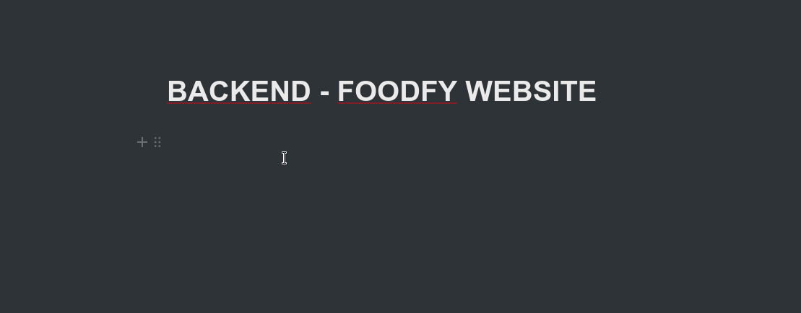

# Projeto Bootcamp Rocketseat - Backend Foodfy

> Nesse desafio vamos refatorar o Foodfy

Dessa vez vamos desenvolver o Backend do Foodfy (o site de uma empresa de receitas). 

## Rodando o projeto:

1 - Clone o projeto e o abra utilizando seu editor preferido.

2 - Abra o arquivo index.html em qualquer navegador e curta o projeto.

## Arquivo de dados

[x] Crie um arquivo data.js na raiz do seu projeto com o conteúdo de link.

## Alterações no projeto

[x] Use os dados das receitas contidos no arquivo data.js para a página de listagem de receitas e para a home.

[x] Na home, liste as 6 primeiras receitas, não é necessário agora sabermos sobre as receitas mais acessadas.

[ ] Na listagem, liste todas receitas do arquivo.
 
 Obs.: Você precisará converter seu projeto em um projeto Node.js usando Nunjucks para mostrar cada página.

 ## Detalhe da receita

[ ] Ao clicar em uma receita agora o usuário deve ser redirecionado para uma nova página contendo todas informações da receita como ingredientes, modo de preparo e informações adicionais (todas essas informações estão contidas no arquivo data.js).

[ ] Na página de listagem não é mais necessário abrir o modal como tínhamos no desafio anterior do Foodfy.

Obs.: A página do detalhe da receita precisa buscar no arquivo data.js apenas a receita desejada pelo usuário, por isso você usará de parâmetros na rota dessa página, por exemplo: http://localhost:3000/recipes/3, nesse caso estaríamos acessando os detalhes da receita com índice 3 no array de receitas (recipes[3]).

Para obter um ID da receita através da URL no Node.js você vai usar conforme o exemplo:

server.get("/recipes/:index", function (req, res) {
  const recipes = [...]; // Array de receitas carregadas do data.js
  const recipeIndex = req.params.index;

  console.log(receipts[recipeIndex]);
})

## Ação de mostrar/esconder

[ ] Dentro da página do detalhe da receita, em cada seção "Ingredientes", "Modo de preparo" e "Informações adicionais" há um botão Mostrar ou Esconder que ao ser clicado deve mostrar ou esconder o texto abaixo do título baseado em seu estado de visibilidade.

## Como contribuir:

-  Faça um fork do projeto;
-  Crie uma nova branch, exemplo: `git checkout -b my-feature`;
-  Commit as modificações, exemplo: `git commit -m 'feat: My new feature'`;
-  Faça um push para a sua branch: `git push origin my-feature`.

Criado por Manfrinne Ferreira [Contato](https://www.linkedin.com/in/manfrinne-ferreira-6033121a7/)